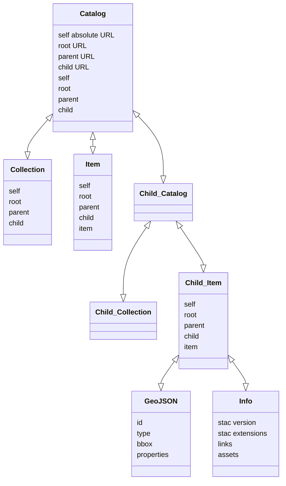

## What is a STAC

The [SpatioTemporal Asset Catalog (STAC)](https://stacspec.org/en){target=_blank} specification provides a common structure for describing and cataloging spatiotemporal assets on the internet. 

A [STAC Browser](https://radiantearth.github.io/stac-browser/#/){target=_blank} allows users to search, preview, and access these massive geospatial assets hosted over conventional `https://` endpoints and cloud-base object stores (i.e., `s3://` buckets).

There are four components to making a given STAC run. They can be used independently of one another, but most often they are all used together:

| Component | Definition | Format |
|-----------|------------|--------|
| `item` | core atomic unit, representing a single spatiotemporal `asset` | `GeoJSON` |
| `catalogs` | a file of links that provides a structure to organize and browse STAC Items | `JSON` |
| `collections` | additional information such as the extents, license, keywords, providers, etc that describe STAC Items | `JSON` |
| `API` | a RESTful endpoint that enables search of STAC Items, specified in [OpenAPI](https://spec.openapis.org/oas/v3.1.0){target=_blank}, following [OGC Web Feature Service 3.0](https://svn.osgeo.org/gdal/trunk/gdal/ogr/ogrsf_frmts/wfs/drv_wfs3.html){target=_blank} | Web Service |

[:material-code-json: Official STAC Tutorial](https://stacspec.org/en/tutorials/intro-to-stac/){target=_blank}



### `asset`

The `assets` are the actual datasets presented through the STAC. 

The `assets` are typically stored in cloud optimized formats like [GeoTIFF (COG)](./cog.md) (`.tif`), [point cloud (COPC)](./copc.md) (`.laz`), or [datacubes](./zarr.md) like HDF5, NetCDF, Xarray, or Zarr (`.hdf`, `.nc`, `.DataArray`, `.zarr`).

within the `assets` block,  the `"href": "https://storage.googleapis.com/open-cogs/stac-examples/20201211_223832_CS2.tif"` points directly to the physical file on the internet.

When the asset file is in a cloud optimized format, it can be read dynamically without downloading the entire file.

??? Info ":material-code-json: Example `assets` block in an `item`"

    ``` json
    "assets": {
        "visual": {
            "href": "https://storage.googleapis.com/open-cogs/stac-examples/20201211_223832_CS2.tif",
            "type": "image/tiff; application=geotiff; profile=cloud-optimized",
            "title": "3-Band Visual",
            "roles": [
                "visual"
            ]
        },
        "thumbnail": {
            "href": "https://storage.googleapis.com/open-cogs/stac-examples/20201211_223832_CS2.jpg",
            "title": "Thumbnail",
            "type": "image/jpeg",
            "roles": [
                "thumbnail"
            ]
        }
    }
    ```

### `items` 

An `item` is described by [GeoJSON](https://cogeo.org) with metadata which describe an `asset` and links to the actual data hosted on the internet. 

[`item` specification](https://github.com/radiantearth/stac-spec/blob/master/item-spec/item-spec.md){target=_blank}

`items` enable the client (a STAC Browser) to scan a `catalog` and present the metadata and to preview the `asset`.

??? Info ":material-code-json: Example `item`"

    [Example simple-item.json](https://raw.githubusercontent.com/radiantearth/stac-spec/master/examples/simple-item.json){target=_blank}

    ``` json
    {
        "stac_version": "1.0.0",
        "stac_extensions": [],
        "type": "Feature",
        "id": "20201211_223832_CS2",
        "bbox": [
            172.91173669923782,
            1.3438851951615003,
            172.95469614953714,
            1.3690476620161975
            ],
        "geometry": {
            "type": "Polygon",
            "coordinates": [
                [
                    [
                        172.91173669923782,
                        1.3438851951615003
                    ],
                    [
                        172.95469614953714,
                        1.3438851951615003
                    ],
                    [
                        172.95469614953714,
                        1.3690476620161975
                    ],
                    [
                        172.91173669923782,
                        1.3690476620161975
                    ],
                    [
                        172.91173669923782,
                        1.3438851951615003
                    ]
                ]
            ]
        },
        "properties": {
        "datetime": "2020-12-11T22:38:32.125000Z"
        },
        "collection": "simple-collection",
        "links": [
            {
                "rel": "collection",
                "href": "./collection.json",
                "type": "application/json",
                "title": "Simple Example Collection"
            },
            {   
                "rel": "root",
                "href": "./collection.json",
                "type": "application/json",
                "title": "Simple Example Collection"
            },
            {
                "rel": "parent",
                "href": "./collection.json",
                "type": "application/json",
                "title": "Simple Example Collection"
            }
        ],
        "assets": {
            "visual": {
                "href": "https://storage.googleapis.com/open-cogs/stac-examples/20201211_223832_CS2.tif",
                "type": "image/tiff; application=geotiff; profile=cloud-optimized",
                "title": "3-Band Visual",
                "roles": [
                    "visual"
                ]
            },
            "thumbnail": {
                "href": "https://storage.googleapis.com/open-cogs/stac-examples/20201211_223832_CS2.jpg",
                "title": "Thumbnail",
                "type": "image/jpeg",
                "roles": [
                    "thumbnail"
                ]
            }
        }
    }
    ```

### `catalogs` 

A `catalog` is a simple, flexible JSON file with links that provides the structure to organize and browse STAC `items`. 

[`catalog` specification](https://github.com/radiantearth/stac-spec/blob/master/catalog-spec/catalog-spec.md){target=_blank}


**STAC Catalog Relation and Media Types**

`Self`: Absolute URL to the JSON file

`Root`: URL to root `catalog` or `collection`

`Parent`: URL to a Parent STAC Specification (could be an `item`, `catalog`, or `collection`)

`Child`: URL to a Child STAC Specification (`item`, `catalog`, or `collection`)

??? Info ":material-code-json: Catalog Relation and Media Type examples"

    ``` json
    {
    "id": "examples",
    "type": "Catalog",
    "title": "Example Catalog",
    "stac_version": "1.0.0",
    "description": "This catalog is a simple demonstration of an example catalog that is used to organize a hierarchy of collections and their items.",
    "links": [
        {
        "rel": "root",
        "href": "./catalog.json",
        "type": "application/json"
        },
        {
        "rel": "child",
        "href": "./extensions-collection/collection.json",
        "type": "application/json",
        "title": "Collection Demonstrating STAC Extensions"
        },
        {
        "rel": "child",
        "href": "./collection-only/collection.json",
        "type": "application/json",
        "title": "Collection with no items (standalone)"
        },
        {
        "rel": "child",
        "href": "./collection-only/collection-with-schemas.json",
        "type": "application/json",
        "title": "Collection with no items (standalone with JSON Schemas)"
        },
        {
        "rel": "item",
        "href": "./collectionless-item.json",
        "type": "application/json",
        "title": "Collection with no items (standalone)"
        },
        {
        "rel": "self",
        "href": "https://raw.githubusercontent.com/radiantearth/stac-spec/v1.0.0/examples/catalog.json",
        "type": "application/json"
        }
    ]
    }
    ```

??? Info ":material-code-json: Example `catalog`"

    [Example of a `catalog](https://raw.githubusercontent.com/radiantearth/stac-spec/master/examples/catalog.json){target=_blank}

    ``` json
    {
    "id": "examples",
    "type": "Catalog",
    "title": "Example Catalog",
    "stac_version": "1.0.0",
    "description": "This catalog is a simple demonstration of an example catalog that is used to organize a hierarchy of collections and their items.",
    "links": [
        {
        "rel": "root",
        "href": "./catalog.json",
        "type": "application/json"
        },
        {
        "rel": "child",
        "href": "./extensions-collection/collection.json",
        "type": "application/json",
        "title": "Collection Demonstrating STAC Extensions"
        },
        {
        "rel": "child",
        "href": "./collection-only/collection.json",
        "type": "application/json",
        "title": "Collection with no items (standalone)"
        },
        {
        "rel": "child",
        "href": "./collection-only/collection-with-schemas.json",
        "type": "application/json",
        "title": "Collection with no items (standalone with JSON Schemas)"
        },
        {
        "rel": "item",
        "href": "./collectionless-item.json",
        "type": "application/json",
        "title": "Collection with no items (standalone)"
        },
        {
        "rel": "self",
        "href": "https://raw.githubusercontent.com/radiantearth/stac-spec/v1.0.0/examples/catalog.json",
        "type": "application/json"
        }
    ]
    }
    ```

### `collections`

`collections` include important annotation metadata about multiple `catalogs` and `items`.

[`collection` specification](https://github.com/radiantearth/stac-spec/blob/master/collection-spec/collection-spec.md){target=_blank}

A simple `collection` contains a minimum of three `JSON` items:

| Component | Definition | Format |
|-----------|------------|--------|
| `simple-item` | | `JSON` |
| `core-item` | | `JSON` |
| `extended-item` | | `JSON` |

??? Info ":material-code-json: Example `collection` items"

    In addition to the three linked items, the `root` and `self` provide links to themselves:

    ``` json
    "links": [
        {
        "rel": "root",
        "href": "./collection.json",
        "type": "application/json",
        "title": "Simple Example Collection"
        },
        {
        "rel": "item",
        "href": "./simple-item.json",
        "type": "application/geo+json",
        "title": "Simple Item"
        },
        {
        "rel": "item",
        "href": "./core-item.json",
        "type": "application/geo+json",
        "title": "Core Item"
        },
        {
        "rel": "item",
        "href": "./extended-item.json",
        "type": "application/geo+json",
        "title": "Extended Item"
        },
        {
        "rel": "self",
        "href": "https://raw.githubusercontent.com/radiantearth/stac-spec/v1.0.0/examples/collection.json",
        "type": "application/json"
        }
    ```    

??? Info ":material-code-json: Example `collection`"

    [Example of a simple-collection.json](https://raw.githubusercontent.com/radiantearth/stac-spec/master/examples/collection.json){target=_blank}

    ``` json
    {
    "id": "simple-collection",
    "type": "Collection",
    "stac_extensions": [
        "https://stac-extensions.github.io/eo/v1.0.0/schema.json",
        "https://stac-extensions.github.io/projection/v1.0.0/schema.json",
        "https://stac-extensions.github.io/view/v1.0.0/schema.json"
    ],
    "stac_version": "1.0.0",
    "description": "A simple collection demonstrating core catalog fields with links to a couple of items",
    "title": "Simple Example Collection",
    "providers": [
        {
        "name": "Remote Data, Inc",
        "description": "Producers of awesome spatiotemporal assets",
        "roles": [
            "producer",
            "processor"
        ],
        "url": "http://remotedata.io"
        }
    ],
    "extent": {
        "spatial": {
        "bbox": [
            [
            172.91173669923782,
            1.3438851951615003,
            172.95469614953714,
            1.3690476620161975
            ]
        ]
        },
        "temporal": {
        "interval": [
            [
            "2020-12-11T22:38:32.125Z",
            "2020-12-14T18:02:31.437Z"
            ]
        ]
        }
    },
    "license": "CC-BY-4.0",
    "summaries": {
        "platform": [
        "cool_sat1",
        "cool_sat2"
        ],
        "constellation": [
        "ion"
        ],
        "instruments": [
        "cool_sensor_v1",
        "cool_sensor_v2"
        ],
        "gsd": {
        "minimum": 0.512,
        "maximum": 0.66
        },
        "eo:cloud_cover": {
        "minimum": 1.2,
        "maximum": 1.2
        },
        "proj:epsg": {
        "minimum": 32659,
        "maximum": 32659
        },
        "view:sun_elevation": {
        "minimum": 54.9,
        "maximum": 54.9
        },
        "view:off_nadir": {
        "minimum": 3.8,
        "maximum": 3.8
        },
        "view:sun_azimuth": {
        "minimum": 135.7,
        "maximum": 135.7
        }
    },
    "links": [
        {
        "rel": "root",
        "href": "./collection.json",
        "type": "application/json",
        "title": "Simple Example Collection"
        },
        {
        "rel": "item",
        "href": "./simple-item.json",
        "type": "application/geo+json",
        "title": "Simple Item"
        },
        {
        "rel": "item",
        "href": "./core-item.json",
        "type": "application/geo+json",
        "title": "Core Item"
        },
        {
        "rel": "item",
        "href": "./extended-item.json",
        "type": "application/geo+json",
        "title": "Extended Item"
        },
        {
        "rel": "self",
        "href": "https://raw.githubusercontent.com/radiantearth/stac-spec/v1.0.0/examples/collection.json",
        "type": "application/json"
        }
    ]
    }
    ```

### API 

The STAC API 

[`API` specification](){target=_blank}

## Creating your own STACs

Generating your own STACs can be done manually, programmatically, or using a templated editor. 

[Create a Catalog with PyStac](https://developers.planet.com/docs/planetschool/introduction-to-stac-part-2-creating-an-example-stac-catalog-of-planet-imagery-with-pystac/){target=_blank}


## Examples of STAC Browser

Radiant Earth maintains the [STAC Browser](https://radiantearth.github.io/stac-browser/#/){target=_blank}

[QGIS STAC Browser Plugin](https://github.com/stac-utils/qgis-stac-plugin){target=_blank}

[Scene Explorer ESRI](https://www.esri.com/en-us/arcgis-marketplace/listing/products/b1689f3ddcf742de988e0d5a070b31c4){target=_blank}

## STAC Major Sponsors & Contributors

Microsoft

Radiant Earth

Planet